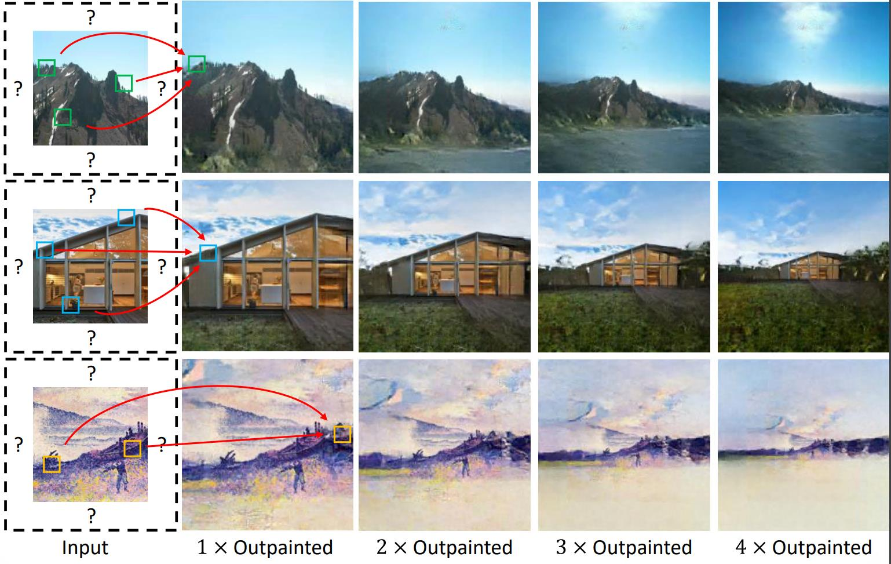

# QueryOTR

## Outpainting by Queries, ECCV 2022. [ArXiv](https://arxiv.org/abs/2207.05312)

we propose a novel hybrid vision-transformer-based encoder-decoder framework, named Query Outpainting TRansformer (QueryOTR), for extrapolating visual context all-side around a given image. Patch-wise mode's global modeling capacity allows us to extrapolate images from the attention mechanism's query standpoint. A novel Query Expansion Module (QEM) is designed to integrate information from the predicted queries based on the encoder's output, hence accelerating the convergence of the pure transformer even with a relatively small dataset. To further enhance connectivity between each patch, the proposed Patch Smoothing Module (PSM) re-allocates and averages the overlapped regions, thus providing seamless predicted images. We experimentally show that QueryOTR could generate visually appealing results smoothly and realistically against the state-of-the-art image outpainting approaches.

<div style="align: center">

</div>

## 1. Requirements
PyTorch >= 1.9.0;
python >= 3.7;
CUDA >= 11.2;
torchvision;

## 2. Data preparation

### Scenery
Scenery consists of about 6,000 images, and we randomly select 1,000 images for evaluation. The training and test dataset can be down [here](https://github.com/z-x-yang/NS-Outpainting)

### WikiArt
The WikiArt datasets can be downloaded [here](https://github.com/cs-chan/ArtGAN/tree/master/WikiArt%20Dataset). We perform a split manner of genres datasets, which contains 45,503 training images and 19,492 testing images


## 3. Training and evaluation
Before you reimplement our results, you need to download the ViT pretrain checkpoint [here](https://dl.fbaipublicfiles.com/mae/pretrain/mae_pretrain_vit_base.pth), and then initialize the encoder weight.


Training on your datasets, run:
```
CUDA_VISIBLE_DEVICES=<GPUs> python main.py --name=EXPERIMENT_NAME --data_root=YOUR_TRAIN_PATH --patch_mean=YOUR_PATCH_MEAN --patch_std=YOUR_PATCH_STD
```

Evaluate on your datasets, run:
```
CUDA_VISIBLE_DEVICES=<GPUs> python evaluate.py --r=EXPERIMENT_NAME --data_root=YOUR_TEST_PATH --patch_mean=YOUR_PATCH_MEAN --patch_std=YOUR_PATCH_STD
```


## Acknowledgements

Our codes are built upon [MAE](https://github.com/facebookresearch/mae), [pytroch-fid](https://github.com/mseitzer/pytorch-fid) and [inception score](https://github.com/sbarratt/inception-score-pytorch)

## Reference

```
@inproceedings{yao2022qotr,
  title={Outpainting by Queries},
  author={Yao, Kai and Gao, Penglei and Yang, Xi and Sun, Jie and Zhang, Rui and Huang, Kaizhu},
  booktitle={Proceedings of the European Conference on Computer Vision (ECCV)},    
  year={2022}
}
```
